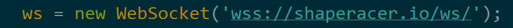

# shaperacer.io - Multiplayer online "io" style game

Currently live at https://shaperacer.io/

Made from fork of https://github.com/uNetworking/pubsub-example/tree/master/uWebSockets.js

Made this game as my first attempt at online multiplayer game with networking, planning on making more games in the future :)

This is the local development version, if you wish to fork this or use it as a model for making a game make the following changes for hosting on a website:

# Running your own live version
**#1** - Change type of app to SSL App in ```server.js``` and add paths to key file and cert file (generate with certbot or similar software)


**#2** - Change location of websocket server in ```mainClient.js```



For full setup instructions for making it live see: 
https://edisonchee.com/writing/intro-to-%C2%B5websockets.js/ 

(only minor note here is that as shown above, I had to do ```ws = new Websocket('wss://shaperacer.io/ws/');``` instead of ```ws = new Websocket('wss://shaperacer.io/ws');``` to get it to work.


# Developing locally
**#1** - Install node (I used v11.5.0 for local development) and install uWebSockets.js ```npm install uNetworking/uWebSockets.js#v16.2.0```

**#2** - run websocket server ```node server.js```

**#3** - Serve client.html from the http server in this repo ```python3 simple_http_server.py``` and then go to http://localhost:1337/src/client.html
